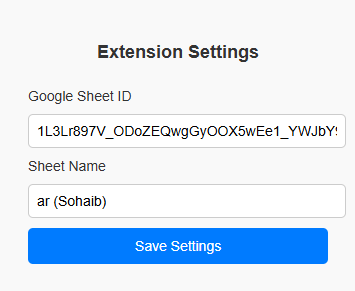
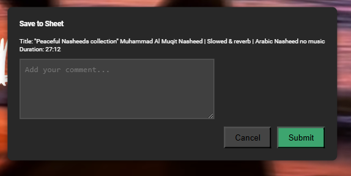

# **Chrome Extension - Google Sheets Integration**  

## 🚀 Overview  
This Chrome extension allows users to **store Google Sheet IDs and Sheet Names** for seamless integration with Google Sheets. It provides a **simple, clean, and modern UI** for managing settings, offering a smooth experience for users who want to link their Google Sheets with ease.

## 🛠️ Features  
✅ **Save Google Sheet ID & Name**  
✅ **Persistent Storage with Chrome Sync**  
✅ **Modern UI with Interactive Feedback**  
✅ **Validation for Empty Fields**  

## 📌 Installation  
1. **Download the Extension** (or clone this repository).  
2. Open **Chrome** and go to `chrome://extensions/`.  
3. Enable **Developer Mode** (toggle on the top right).  
4. Click **Load Unpacked** and select the project folder.  

## 🖥️ Usage  
1. Click the extension icon in Chrome.  
2. Enter your **Google Sheet ID** and **Sheet Name**.  
3. Click **Save Settings**.  
4. Your settings will be stored and used by the extension to integrate with Google Sheets seamlessly.

## 📂 Project Structure 
/extension-folder
│── popup.html # UI for settings
│── styles.css # Modern styles
│── popup.js # Handles storage & interactions
│── manifest.json # Chrome extension config

## 🎨 UI Preview  

## 🛠️ Tech Stack  
- **HTML, CSS, JavaScript**  
- **Chrome Storage API**  
- **Modern UI/UX**  

## 📝 License  
This project is **open-source** and free to use. Feel free to fork and contribute!  