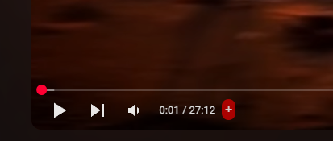

# **Chrome Extension - Save YouTube Links to Google Sheets**  

## 🚀 Overview  
This Chrome extension allows users to **save YouTube video links, durations, and personal comments** directly to a **Google Sheet**. It provides a **simple, clean, and modern UI** for seamless integration, making it easy to keep track of videos you watch.

## 🛠️ Features  
✅ **Save YouTube Video URL, Duration & Comment**  
✅ **Persistent Storage with Chrome Sync**  
✅ **One-Click Save from YouTube Page**  
✅ **Modern UI with Interactive Feedback**  
✅ **Validation for Empty Fields**  

## 📌 Installation  
1. **Download the Extension** (or clone this repository).  
2. Open **Chrome** and go to `chrome://extensions/`.  
3. Enable **Developer Mode** (toggle on the top right).  
4. Click **Load Unpacked** and select the project folder.  

## 🖥️ Usage  
1. Open a YouTube video.  
2. Click the extension icon in Chrome.  
3. The video link and duration will be automatically retrieved.  
4. Enter your comment (optional).  
5. Click **Save to Google Sheet**.  
6. Your data will be saved to the linked Google Sheet.  

## 📂 Project Structure  
/extension-folder  
│── popup.html # UI for settings and saving data  
│── styles.css # Modern styles  
│── popup.js # Handles storage & interactions  
│── background.js # Manages YouTube data extraction  
│── manifest.json # Chrome extension config  

## 🎨 UI Preview  
  
  
  

## 🛠️ Tech Stack  
- **HTML, CSS, JavaScript**  
- **Chrome Storage API**  
- **YouTube API for Video Duration**  
- **Google Sheets API**  
- **Modern UI/UX**  

## 📝 License  
This project is **open-source** and free to use. Feel free to fork and contribute!
